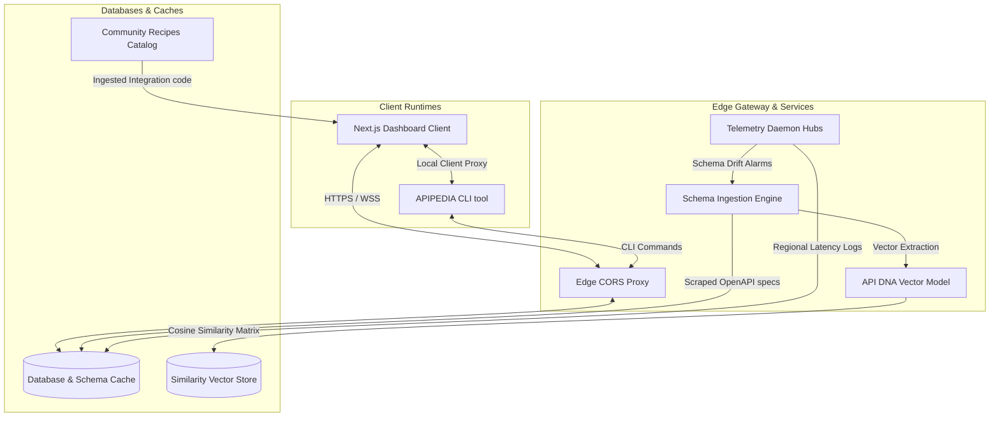

# APIPEDIA — Developer Intelligence Platform

APIPEDIA is an automated developer intelligence platform that replaces manual API lookup with real-time telemetry, live SDK analysis, and schema-compliant playgrounds.

---

## Architecture Diagram



---

## Core Capabilities

* **Interactive Playground**: Test queries inside live CORS sandbox proxies or client-side schema mocks with zero initial setup.
* **Global Telemetry**: Synthetic endpoint probes dispatched from 5 global locations (US-East, EU-Central, AP-South, SA-East, US-West) checking p50/p99 latency.
* **Invisible AI Diagnostics**: In-context troubleshooting explaining code syntax faults and parameter verification limits automatically.
* **API DNA Alignment**: Group and match related provider frameworks (such as Stripe vs. Adyen or Clerk vs. Auth0) using vector similarity weights.

---

## Directory Structure

```
.
├── backend/            # Disposable legacy Django/FastAPI scaffold
├── docs/               # Modular brand copy and documentation files
│   ├── brand/          # Voice, tone, and UX writing templates
│   ├── product/        # Onboarding flows, feature scopes, and FAQs
│   ├── ui/             # Dynamic dashboard labels and state microcopy
│   └── website/        # SEO configurations and landing page copies
├── server/             # Production Fastify, Prisma, Postgres services
└── src/                # Next.js frontend source files
    ├── app/            # App routes and dashboard layout files
    ├── components/     # Reusable client view components
    └── lib/            # Local SDK scripts and proxy APIs
```

---

## Getting Started

### 1. Requirements
Ensure you have the following installed locally:
* Node.js v22.x or later
* Git CLI

### 2. Install Dependencies
Clone the repository and install the npm workspace packages:
```bash
git clone https://github.com/Abhishek1106kr/apiPedia.git
cd apiPedia
npm install
```

### 3. Run Development Server
Boot the Next.js development server:
```bash
npm run dev
```
Open your browser and navigate to `http://localhost:3000` to interact with the dashboard.

---

## Platform CLI Tools

APIPEDIA includes a local tool to support sandbox configurations. Install and verify:

```bash
# Query health benchmarks from edge runners
apipedia telemetry clerk

# Run a local mock gateway on port 8080
apipedia mock run clerk --port 8080
```
