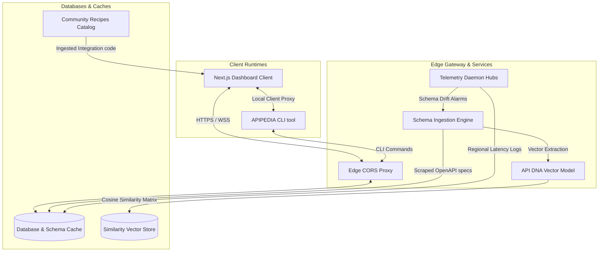

# APIPEDIA — Developer Intelligence Platform

APIPEDIA is an automated developer intelligence platform that replaces manual API lookup with real-time telemetry, live SDK analysis, and schema-compliant playgrounds.

---

## Architecture Diagram



---

## Core Capabilities

* **Interactive Playground**: Test queries inside live CORS sandbox proxies or client-side schema mocks with zero initial setup.
* **Global Telemetry**: Synthetic endpoint probes dispatched from 5 global locations (US-East, EU-Central, AP-South, SA-East, US-West) checking p50/p99 latency.
* **Invisible AI Diagnostics**: In-context troubleshooting explaining code syntax faults and parameter verification limits automatically.
* **API DNA Alignment**: Group and match related provider frameworks (such as Stripe vs. Adyen or Clerk vs. Auth0) using vector similarity weights.

---

## Directory Structure

```
.
├── backend/            # Disposable legacy Django/FastAPI scaffold
├── docs/               # Modular brand copy and documentation files
│   ├── brand/          # Voice, tone, and UX writing templates
│   ├── product/        # Onboarding flows, feature scopes, and FAQs
│   ├── ui/             # Dynamic dashboard labels and state microcopy
│   └── website/        # SEO configurations and landing page copies
├── server/             # Production Fastify, Prisma, Postgres services
└── src/                # Next.js frontend source files
    ├── app/            # App routes and dashboard layout files
    ├── components/     # Reusable client view components
    └── lib/            # Local SDK scripts and proxy APIs
```

---

## Getting Started

### 1. Requirements
Ensure you have the following installed locally:
* Node.js v22.x or later
* Docker (for the backend's Postgres and Redis)
* Git CLI

### 2. Frontend
```bash
git clone https://github.com/Abhishek1106kr/apiPedia.git
cd apiPedia
npm install
npm run dev
```
Open `http://localhost:3000` — this alone gets you the dashboard against its
built-in mock dataset (`src/app/data.ts`). It does not talk to the backend
below yet; that integration is still in progress.

### 3. Backend (`server/`)
```bash
cd server
npm install
cp .env.example .env        # then fill in GROQ_API_KEY if you want the AI routes
docker compose up -d        # Postgres + Redis
npx prisma migrate deploy   # apply the schema
npm run dev                 # Fastify on :4000
```
Two optional long-running workers, each in its own terminal:
```bash
npm run ingest:worker    # processes queued ingestion jobs (Phase 3)
npm run monitor:worker   # checks every known API's reachability every 5 minutes (Phase 6)
```

---

## CLI Tools

The real local tooling that exists today lives in `server/` (there is no
globally-installed `apipedia` binary):

```bash
# Fetch live GitHub + OpenAPI spec data for a known API id (see
# server/src/ingestion/seeds.ts for the current list) and print the draft
npm run ingest -- stripe

# Run a check round against every known API right now, instead of waiting
# for the monitor worker's next 5-minute tick
curl -X POST http://localhost:4000/api/monitoring/run-now
```
