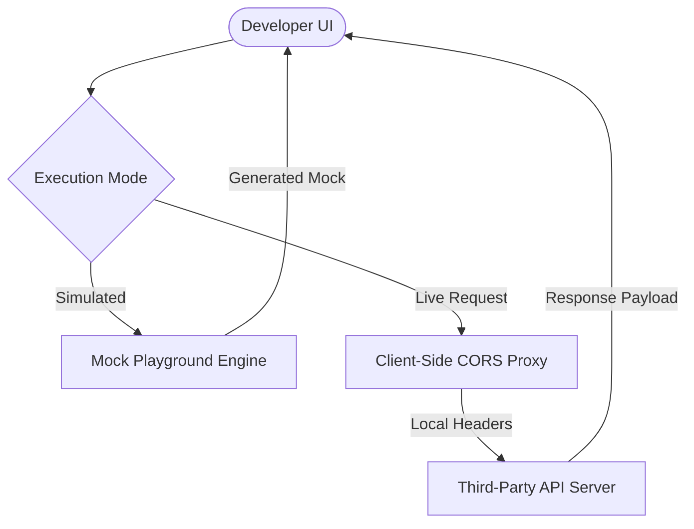

# APIPEDIA Core Features Technical Guide

This document provides a developer-level explanation of APIPEDIA's key platform features. It outlines how our automated systems parse schemas, benchmark performance, map API similarity, and support community integrations.

---

## Interactive Playground

The Interactive Playground allows developers to test HTTP requests directly from the APIPEDIA interface. It supports two distinct operational modes.

### Playground Execution Model



#### 1. Simulated Mode (Sandbox)
Before you obtain credentials, APIPEDIA can simulate any API's endpoint behavior. Requests are intercepted by a client-side mock runner that inspects the path parameters and HTTP method, yielding a schema-compliant mock response instantly with zero network delay.

#### 2. Live Request Mode
When you enter your own development credentials, the playground transitions to Live Mode. To safeguard your credentials:
* Requests are dispatched **directly from your browser** to the provider’s endpoints (utilizing CORS headers where supported).
* Alternatively, requests can run through your locally running APIPEDIA CLI container proxy (`apipedia proxy`), ensuring credentials never transit our central servers.

---

## AI-Powered Developer Intelligence

APIPEDIA employs an invisible helper model designed to solve the most common integration hurdle: **undocumented error handling**.

### How it works:
1. **Error Interception**: If a playground execution returns a non-2xx status code, the payload is captured.
2. **Context Compilation**: The engine retrieves the failing endpoint schema, the sent payload parameters, and our community database of known errors.
3. **Actionable Remediation**: Instead of printing a generic `400 Bad Request` or `422 Unprocessable Entity`, the dashboard displays a clear, code-focused summary:
   * The specific parameter failing validation (e.g., `user_id` format).
   * A modified code snippet correcting the issue.
   * Links to active GitHub issues or recipes detailing the exact problem.

---

## API Telemetry & Regional Latency

Our telemetry engine monitors API performance from the user perspective—not the provider’s internal dashboards.

### Global Telemetry Daemons
We operate telemetry runners in 5 major edge locations:
* `us-east` (Northern Virginia)
* `eu-central` (Frankfurt)
* `ap-south` (Mumbai)
* `sa-east` (São Paulo)
* `us-west` (Oregon)

### Monitoring Pipeline
* **Synthetic Pings**: Every 60 seconds, daemons execute safe, low-impact GET queries against provider status endpoints.
* **Payload Validation**: We verify that the returned JSON structures match the cached OpenAPI schemas. A changes in response schema structure is flagged as a silent drift incident.
* **Metric Distribution**: Latency profiles are compiled into percentiles (`p50`, `p90`, `p99`) to highlight packet loss or gateway delays during load spikes.

---

## API DNA & Similarity Matching

The similarity engine parses the structural and behavioral footprint—the **DNA**—of APIs to identify matches and alternatives.

### DNA Parameters Analyzed
* **Protocol & Paradigm**: (e.g., REST, GraphQL, gRPC, WebSockets).
* **Authentication Mechanics**: (e.g., OAuth2, Bearer Token, HMAC Signatures, Custom API Keys).
* **Entity Type Density**: Structural layout of schemas (e.g., nested payments objects, pagination patterns).

### Vector Similarity Model
API profiles are vectorized and indexed. When looking at a dynamic API detail page, APIPEDIA calculates the cosine similarity to recommend alternatives:
* **Stripe DNA Profile**: High overlap with Adyen, Braintree, and Razorpay.
* **Clerk DNA Profile**: High overlap with Auth0, Kinde, and WorkOS.

---

## Community Recipes System

Recipes are modular integration guides that combine multiple APIs to solve a real-world task (e.g., *“Sync Stripe Webhooks to Airtable via Clerk Auth”*).

### Authoring Recipes
Recipes are defined using a structured Markdown-based schema with JSON configuration headers:

```yaml
---
title: "Sync Stripe webhook metadata to Airtable base"
description: "Automatically captures customer.subscription.created events and updates Airtable records."
apis:
  - stripe
  - airtable
difficulty: "Medium"
runtime: "Node.js (TypeScript)"
---
```

### Verification Pipeline
1. **GitHub PR Submission**: Developers submit recipe files to the open-source repository.
2. **Static Check**: CI validators check that the listed API integrations refer to valid IDs in our catalog.
3. **Execution Check**: Our automated testing runner executes the recipe's code sample against sandbox mock runners to verify it executes without error.
4. **Merge**: Once checks pass, the recipe is indexed and appears instantly on both API detail pages.
